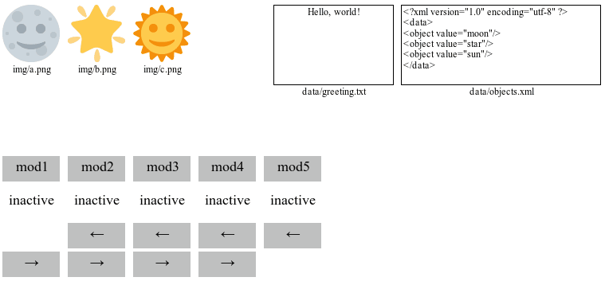

# Polymod

An atomic modding framework for Haxe games/apps.

Polymod allows users of your application to easily and seamlessly replace assets in your application, and manage those asset replacements in a centralized way as mods. It also provides a scripting system powered by HScript, and integration with FireTongue to load assets conditionally based on the currently selected locale.

Polymod supports the following Haxe frameworks:
- OpenFL
- HEAPS
- NME
- Lime (with or without OpenFL)
- Custom (provide your own backend)

- KHA (Coming Soon)
- Castle (Coming Soon)
- Ceramic (Coming Soon)

## Basic sample:


## Installation

Polymod is now available via [HaxeLib](https://lib.haxe.org/p/polymod/)! If you have previously installed Polymod directly from git, please update your installation:

```
haxelib install polymod
```

## What is Polymod?

Let's say you have a game or app that you want to make moddable. The easiest way to do this is to:

1. Make your game data-driven (expose as much of your content in the form of loose data files as possible)
2. Let players provide their own data files

Easy enough. But what if you want players to be able to use multiple mods together? How do you manage that?

Polymod solves both problems.

First, it **overrides your framework's asset system** with a custom one pointed at a mod folder (or folders) somewhere on the user's hard drive. Whenever you request an asset via `Assets.getBitmapData()` or `Res.loader.load()` call or whatever, the custom backend first checks if the mod has a modified version of this file. If it does, it returns the mod's modified version. If it doesn't, it falls through to the default asset system (the assets included with the game).

Second, it **combines mods atomically**. Instead of supplying one mod folder, you can provide several. Polymod will go through each folder in turn and apply the changes from each mod, automatically joining them into one combined mod at runtime. Note that this means that the order you load the mods in matters, in the case that they have overlapping changes.

Polymod currently works with  desktop* targets, and will eventually support other frameworks and targets.

\**`sys` target, technically. Any target with a File System.*

Polymod supports the following kinds of operations:
- Replace asset
- Append data to the end of existing asset (text only)
- Merge data at a specified location within an existing asset (text only)

Replace logic works on any asset format.
Append logic works only on text assets.
Merge logic is currently supported for plaintext (TXT), CSV, TSV, and XML asset formats only. Support for JSON is planned.

Samples for the OpenFL, Lime, NME, and HEAPS frameworks are provided.

## Basic Usage

Loading one mod:
```haxe
Polymod.init({
  modRoot:"path/to/mods/",
  dirs:["mymod"]
 });
```

Loading multiple mods:
```haxe
Polymod.init({
  modRoot:"path/to/mods/",
  dirs:["firstmod","secondmod","thirdmod","etc"]
 });
```

> ***NOTE**: On Mac, the default application working directory is `<APPLICATION_NAME>.app/Contents/Resources`, which differs    from Windows and Linux. If you hard code the search path for your game's mod directory, be sure to account for this difference    when targeting the Mac platform.*

Be sure to call `Polymod.init()` before you load any assets. Also note that calling `Polymod.init()` will clear your Asset cache.

After that, you just load your assets as normal:

OpenFL / NME:
```haxe
var myImage = Assets.getBitmapData("myImage.png");
```

Lime:
```haxe
var myImage = Assets.getImage("myImage.png");
```

HEAPS:
```haxe
var myImage = Res.loader.load("myImage.png");
```

This will return either the default asset, or a modified version if it's been replaced by a loaded mod.

## Documentation

For further documentation on how to configure and use Polymod in your application, please see the [Polymod website](http://larsiusprime.github.io/polymod/docs/).

## Further Reading

https://www.fortressofdoors.com/player-friendly-atomic-game-modding/
